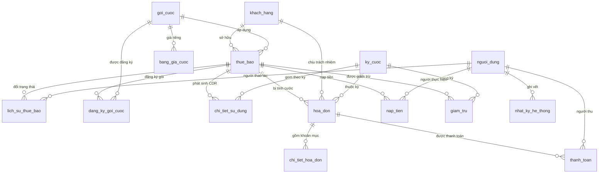

# MÔ TẢ CƠ SỞ DỮ LIỆU `vnpt_billing`

**Đề tài:** Xây dựng phần mềm quản lý thuê bao và tính cước điện thoại
**Môn học:** Thực tập nghề nghiệp — Phase 1
**Hệ quản trị:** MySQL 8.4 · InnoDB · `utf8mb4` / `utf8mb4_unicode_ci`

> Toàn bộ dữ liệu trong hệ thống là **dữ liệu mẫu tự sinh** phục vụ học tập.
> Không sử dụng dữ liệu thật của bất kỳ nhà mạng nào.

---

## 1. Tổng quan

CSDL gồm **15 bảng** và **2 view**, chia thành 4 nhóm chức năng:

| Nhóm | Bảng |
|---|---|
| Quản trị & danh mục | `nguoi_dung`, `khach_hang`, `goi_cuoc`, `bang_gia_cuoc` |
| Thuê bao | `thue_bao`, `lich_su_thue_bao`, `dang_ky_goi_cuoc` |
| Tính cước | `ky_cuoc`, `chi_tiet_su_dung`, `giam_tru` |
| Hóa đơn & thu tiền | `hoa_don`, `chi_tiet_hoa_don`, `thanh_toan`, `nap_tien` |
| Hệ thống | `nhat_ky_he_thong` |

### Sơ đồ quan hệ

### Quy ước chung

- Mọi bảng có khóa chính `id BIGINT AUTO_INCREMENT`.
- Tên bảng và cột dùng **tiếng Việt không dấu, `snake_case`**; phía Java dùng `camelCase`.
- Mọi trường tiền tệ dùng `DECIMAL`, **không dùng** `FLOAT`/`DOUBLE` để tránh sai số làm tròn.
- `DECIMAL(15,2)` cho số tiền thông thường, `DECIMAL(18,2)` cho số cộng dồn lớn (doanh thu kỳ).
- Cột cờ nhị phân dùng `TINYINT` (0/1), phía Java map sang `Boolean` kèm `@JdbcTypeCode(SqlTypes.TINYINT)`.
- Kiểu `ENUM` của MySQL map sang `enum` Java qua `@Enumerated(EnumType.STRING)`; **tên hằng phải khớp tuyệt đối**.

---

## 2. Chi tiết từng bảng

### 2.1. `nguoi_dung` — Tài khoản đăng nhập hệ thống

| Tên trường | Kiểu dữ liệu | Ràng buộc | Ý nghĩa |
|---|---|---|---|
| `id` | BIGINT | PK, AUTO_INCREMENT | Khóa chính |
| `ten_dang_nhap` | VARCHAR(50) | NOT NULL, UNIQUE | Tên đăng nhập |
| `mat_khau` | VARCHAR(100) | NOT NULL | Mật khẩu đã băm BCrypt, không lưu dạng thô |
| `ho_ten` | VARCHAR(100) | NOT NULL | Họ tên đầy đủ |
| `email` | VARCHAR(100) | | Thư điện tử liên hệ |
| `vai_tro` | ENUM | NOT NULL | `ADMIN` / `NHAN_VIEN` / `KE_TOAN` |
| `trang_thai` | TINYINT | DEFAULT 1 | 1 = đang hoạt động, 0 = đã khóa |
| `ngay_tao` | DATETIME | | Thời điểm tạo tài khoản |

### 2.2. `khach_hang` — Khách hàng cá nhân và doanh nghiệp

| Tên trường | Kiểu dữ liệu | Ràng buộc | Ý nghĩa |
|---|---|---|---|
| `id` | BIGINT | PK, AUTO_INCREMENT | Khóa chính |
| `ma_kh` | VARCHAR(20) | NOT NULL, UNIQUE | Mã khách hàng, dạng `KH0001` |
| `loai_kh` | ENUM | NOT NULL | `CA_NHAN` / `DOANH_NGHIEP` |
| `ten_kh` | VARCHAR(200) | NOT NULL, INDEX | Họ tên cá nhân hoặc tên doanh nghiệp |
| `so_giay_to` | VARCHAR(30) | NOT NULL, INDEX | CCCD (12 số) với cá nhân, MST (10 số) với doanh nghiệp |
| `ngay_sinh` | DATE | | Ngày sinh, chỉ dùng cho khách cá nhân |
| `nguoi_dai_dien` | VARCHAR(100) | | Người đại diện pháp luật, chỉ dùng cho doanh nghiệp |
| `dia_chi` | VARCHAR(300) | NOT NULL | Địa chỉ liên hệ |
| `dien_thoai_lh` | VARCHAR(15) | | Số điện thoại liên hệ |
| `email` | VARCHAR(100) | | Thư điện tử |
| `ngay_dang_ky` | DATE | NOT NULL | Ngày trở thành khách hàng |
| `trang_thai` | ENUM | NOT NULL | `HOAT_DONG` / `NGUNG_GIAO_DICH` |
| `ghi_chu` | TEXT | | Ghi chú tự do |

### 2.3. `goi_cuoc` — Danh mục gói cước

| Tên trường | Kiểu dữ liệu | Ràng buộc | Ý nghĩa |
|---|---|---|---|
| `id` | BIGINT | PK, AUTO_INCREMENT | Khóa chính |
| `ma_goi` | VARCHAR(20) | NOT NULL, UNIQUE | Mã gói, ví dụ `MAX150` |
| `ten_goi` | VARCHAR(100) | NOT NULL | Tên hiển thị của gói |
| `loai_thue_bao` | ENUM | NOT NULL | `TRA_TRUOC` / `TRA_SAU` — gói chỉ áp dụng cho đúng loại này |
| `cuoc_thue_bao_thang` | DECIMAL(15,2) | NOT NULL, DEFAULT 0 | Cước cố định thu hằng tháng |
| `phut_noi_mang_mien_phi` | INT | DEFAULT 0 | Số phút gọi nội mạng được miễn phí |
| `phut_ngoai_mang_mien_phi` | INT | DEFAULT 0 | Số phút gọi ngoại mạng được miễn phí |
| `sms_mien_phi` | INT | DEFAULT 0 | Số tin nhắn được miễn phí |
| `data_mien_phi_mb` | INT | DEFAULT 0 | Dung lượng data miễn phí, đơn vị MB |
| `mo_ta` | TEXT | | Diễn giải ưu đãi của gói |
| `ngay_hieu_luc` | DATE | NOT NULL | Ngày gói bắt đầu áp dụng |
| `ngay_het_hieu_luc` | DATE | | Ngày gói ngừng áp dụng, NULL = còn hiệu lực |
| `trang_thai` | TINYINT | DEFAULT 1 | 1 = còn mở bán, 0 = ngừng bán |

### 2.4. `bang_gia_cuoc` — Đơn giá theo dịch vụ / hướng / khung giờ

| Tên trường | Kiểu dữ liệu | Ràng buộc | Ý nghĩa |
|---|---|---|---|
| `id` | BIGINT | PK, AUTO_INCREMENT | Khóa chính |
| `goi_cuoc_id` | BIGINT | FK → `goi_cuoc(id)`, NULL được | **NULL = đơn giá mặc định** áp dụng chung cho mọi gói |
| `loai_dich_vu` | ENUM | NOT NULL, INDEX | `THOAI` / `SMS` / `DATA` |
| `huong` | ENUM | NOT NULL, INDEX | `NOI_MANG` / `NGOAI_MANG` / `QUOC_TE` |
| `gio_cao_diem` | TINYINT | DEFAULT 0 | 1 = đơn giá giờ cao điểm |
| `block_giay` | INT | NOT NULL, DEFAULT 6 | Đơn vị tính block: giây (thoại), 1 tin (SMS), 1 MB (data) |
| `don_gia` | DECIMAL(15,2) | NOT NULL | Đơn giá cho mỗi block |
| `ngay_hieu_luc` | DATE | NOT NULL, INDEX | Ngày bảng giá bắt đầu áp dụng |
| `ngay_het_hieu_luc` | DATE | | NULL = còn hiệu lực |

> **Chỉ mục** `idx_bang_gia_tra_cuu (loai_dich_vu, huong, ngay_hieu_luc)` phục vụ engine
> tính cước tra giá cho từng bản ghi CDR — đây là truy vấn nóng nhất của hệ thống.

### 2.5. `thue_bao` — Thuê bao điện thoại

| Tên trường | Kiểu dữ liệu | Ràng buộc | Ý nghĩa |
|---|---|---|---|
| `id` | BIGINT | PK, AUTO_INCREMENT | Khóa chính |
| `so_thue_bao` | VARCHAR(15) | NOT NULL, UNIQUE | Số điện thoại |
| `khach_hang_id` | BIGINT | NOT NULL, FK → `khach_hang(id)`, INDEX | Chủ sở hữu thuê bao |
| `goi_cuoc_id` | BIGINT | NOT NULL, FK → `goi_cuoc(id)` | Gói cước đang áp dụng |
| `loai_thue_bao` | ENUM | NOT NULL | `TRA_TRUOC` / `TRA_SAU` |
| `ngay_kich_hoat` | DATE | NOT NULL | Ngày hòa mạng |
| `ngay_huy` | DATE | | Ngày thanh lý, NULL nếu chưa thanh lý |
| `trang_thai` | ENUM | NOT NULL | `HOAT_DONG` / `TAM_NGUNG_1C` / `TAM_NGUNG_2C` / `DA_THANH_LY` |
| `so_du` | DECIMAL(15,2) | DEFAULT 0 | Số dư tài khoản, **chỉ có ý nghĩa với trả trước** |
| `han_muc_tin_dung` | DECIMAL(15,2) | DEFAULT 0 | Hạn mức nợ cước, **chỉ có ý nghĩa với trả sau** |
| `ngay_tao` | DATETIME | | Thời điểm tạo bản ghi |

> `TAM_NGUNG_1C` = tạm ngưng một chiều (chỉ nhận, không gọi đi).
> `TAM_NGUNG_2C` = tạm ngưng hai chiều (khóa cả hai chiều).

### 2.6. `lich_su_thue_bao` — Nhật ký đổi trạng thái thuê bao

| Tên trường | Kiểu dữ liệu | Ràng buộc | Ý nghĩa |
|---|---|---|---|
| `id` | BIGINT | PK, AUTO_INCREMENT | Khóa chính |
| `thue_bao_id` | BIGINT | NOT NULL, FK → `thue_bao(id)`, INDEX | Thuê bao bị đổi trạng thái |
| `trang_thai_cu` | VARCHAR(20) | | Trạng thái trước khi đổi |
| `trang_thai_moi` | VARCHAR(20) | NOT NULL | Trạng thái sau khi đổi |
| `ly_do` | VARCHAR(300) | | Lý do thực hiện |
| `nguoi_thuc_hien_id` | BIGINT | FK → `nguoi_dung(id)` | Người thao tác |
| `thoi_gian` | DATETIME | NOT NULL | Thời điểm thực hiện |

### 2.7. `dang_ky_goi_cuoc` — Lịch sử đăng ký gói cước

| Tên trường | Kiểu dữ liệu | Ràng buộc | Ý nghĩa |
|---|---|---|---|
| `id` | BIGINT | PK, AUTO_INCREMENT | Khóa chính |
| `thue_bao_id` | BIGINT | NOT NULL, FK → `thue_bao(id)`, INDEX | Thuê bao đăng ký |
| `goi_cuoc_id` | BIGINT | NOT NULL, FK → `goi_cuoc(id)` | Gói được đăng ký |
| `ngay_bat_dau` | DATE | NOT NULL | Ngày bắt đầu áp dụng gói |
| `ngay_ket_thuc` | DATE | | Ngày kết thúc, NULL nếu đang áp dụng |
| `trang_thai` | ENUM | NOT NULL | `DANG_AP_DUNG` / `DA_KET_THUC` |

> Bảng này tách riêng khỏi `thue_bao.goi_cuoc_id` để giữ được **lịch sử đổi gói**.
> `thue_bao.goi_cuoc_id` chỉ phản ánh gói hiện hành, còn bảng này lưu toàn bộ quá trình.

### 2.8. `ky_cuoc` — Kỳ tính cước theo tháng

| Tên trường | Kiểu dữ liệu | Ràng buộc | Ý nghĩa |
|---|---|---|---|
| `id` | BIGINT | PK, AUTO_INCREMENT | Khóa chính |
| `thang` | INT | NOT NULL, UNIQUE(thang, nam) | Tháng của kỳ (1–12) |
| `nam` | INT | NOT NULL, UNIQUE(thang, nam) | Năm của kỳ |
| `ngay_bat_dau` | DATE | NOT NULL | Ngày đầu kỳ |
| `ngay_ket_thuc` | DATE | NOT NULL | Ngày cuối kỳ |
| `trang_thai` | ENUM | NOT NULL | `MO` / `DANG_TINH` / `DA_CHOT` |
| `ngay_chot` | DATETIME | | Thời điểm chốt kỳ |
| `so_cdr_xu_ly` | INT | DEFAULT 0 | Số bản ghi CDR đã xử lý trong kỳ |
| `so_hoa_don_tao` | INT | DEFAULT 0 | Số hóa đơn đã phát hành trong kỳ |
| `tong_doanh_thu` | DECIMAL(18,2) | DEFAULT 0 | Tổng doanh thu của kỳ |

> **Ràng buộc `UNIQUE(thang, nam)`** đảm bảo mỗi tháng chỉ tồn tại đúng một kỳ cước.

### 2.9. `chi_tiet_su_dung` — Bản ghi CDR (Call Detail Record)

| Tên trường | Kiểu dữ liệu | Ràng buộc | Ý nghĩa |
|---|---|---|---|
| `id` | BIGINT | PK, AUTO_INCREMENT | Khóa chính |
| `thue_bao_id` | BIGINT | NOT NULL, FK → `thue_bao(id)`, INDEX | Thuê bao phát sinh |
| `so_thue_bao` | VARCHAR(15) | NOT NULL | Số thuê bao **lưu lặp lại** tại thời điểm phát sinh |
| `so_bi_goi` | VARCHAR(20) | | Số bị gọi hoặc số nhận tin |
| `loai_dich_vu` | ENUM | NOT NULL | `THOAI` / `SMS` / `DATA` |
| `huong` | ENUM | NOT NULL | `NOI_MANG` / `NGOAI_MANG` / `QUOC_TE` |
| `thoi_gian_bat_dau` | DATETIME | NOT NULL, INDEX | Thời điểm bắt đầu sử dụng |
| `thoi_luong_giay` | INT | DEFAULT 0 | Thời lượng cuộc gọi (giây), chỉ dùng cho `THOAI` |
| `so_luong` | INT | DEFAULT 0 | Số tin với `SMS`, số **KB** với `DATA` |
| `gio_cao_diem` | TINYINT | DEFAULT 0 | 1 = phát sinh trong giờ cao điểm |
| `cuoc_phi` | DECIMAL(15,2) | | Cước tính được, NULL khi chưa tính |
| `mien_phi` | TINYINT | DEFAULT 0 | 1 = nằm trong ưu đãi của gói nên không thu tiền |
| `trang_thai_tinh_cuoc` | ENUM | NOT NULL, DEFAULT `CHUA_TINH`, INDEX | `CHUA_TINH` / `DA_TINH` / `LOI` |
| `ky_cuoc_id` | BIGINT | FK → `ky_cuoc(id)` | Kỳ cước mà bản ghi được gom vào |
| `nguon` | ENUM | | `GENERATOR` / `IMPORT_CSV` / `NHAP_TAY` |

> Cột `so_thue_bao` **cố ý trùng lặp** với `thue_bao.so_thue_bao`. CDR là dữ liệu lịch sử:
> nếu thuê bao bị thanh lý và số được cấp lại cho khách khác, bản ghi cũ vẫn phải giữ
> đúng số tại thời điểm phát sinh.

> ⚠️ **Đơn vị của `so_luong` với dịch vụ DATA đã đổi ở Phase 3: từ MB sang KB.**
> Bộ sinh CDR sinh giá trị 1024–512000 KB (tức 1 MB đến 500 MB mỗi phiên), và màn hình
> tra cứu CDR quy đổi sang MB khi hiển thị.
>
> **Việc Phase 4 phải xử lý:** dòng bảng giá `DATA` hiện có `block_giay = 1` và đơn giá
> 25 đ, vốn được đặt theo giả định "1 block = 1 MB". Khi viết engine tính cước phải
> chọn một trong hai cách, không được bỏ qua:
> - Chia `so_luong` cho 1024 để đổi về MB trước khi nhân đơn giá, hoặc
> - Đổi `block_giay` của dòng DATA thành 1024 để block đúng bằng 1 MB tính theo KB
>
> Nếu bỏ qua, cước data sẽ bị tính cao gấp 1024 lần.

### 2.10. `hoa_don` — Hóa đơn cước tháng

| Tên trường | Kiểu dữ liệu | Ràng buộc | Ý nghĩa |
|---|---|---|---|
| `id` | BIGINT | PK, AUTO_INCREMENT | Khóa chính |
| `ma_hoa_don` | VARCHAR(30) | NOT NULL, UNIQUE | Số hóa đơn |
| `thue_bao_id` | BIGINT | NOT NULL, FK → `thue_bao(id)`, **UNIQUE(thue_bao_id, ky_cuoc_id)** | Thuê bao bị tính cước |
| `khach_hang_id` | BIGINT | NOT NULL, FK → `khach_hang(id)`, INDEX | Khách hàng chịu trách nhiệm thanh toán |
| `ky_cuoc_id` | BIGINT | NOT NULL, FK → `ky_cuoc(id)`, **UNIQUE(thue_bao_id, ky_cuoc_id)** | Kỳ cước |
| `ngay_lap` | DATE | NOT NULL | Ngày phát hành hóa đơn |
| `han_thanh_toan` | DATE | NOT NULL | Hạn thanh toán |
| `cuoc_thue_bao` | DECIMAL(15,2) | DEFAULT 0 | Cước thuê bao tháng |
| `cuoc_thoai` | DECIMAL(15,2) | DEFAULT 0 | Cước thoại phát sinh |
| `cuoc_sms` | DECIMAL(15,2) | DEFAULT 0 | Cước tin nhắn phát sinh |
| `cuoc_data` | DECIMAL(15,2) | DEFAULT 0 | Cước data phát sinh |
| `cuoc_khac` | DECIMAL(15,2) | DEFAULT 0 | Các khoản cước khác |
| `giam_tru` | DECIMAL(15,2) | DEFAULT 0 | Tổng khoản giảm trừ |
| `tong_truoc_thue` | DECIMAL(15,2) | NOT NULL | Cộng các khoản cước, trừ giảm trừ |
| `thue_vat` | DECIMAL(15,2) | NOT NULL | Thuế giá trị gia tăng |
| `tong_thanh_toan` | DECIMAL(15,2) | NOT NULL | Số tiền phải trả = trước thuế + VAT |
| `da_thanh_toan` | DECIMAL(15,2) | DEFAULT 0 | Số tiền đã thu |
| `con_no` | DECIMAL(15,2) | NOT NULL | Số tiền còn nợ |
| `trang_thai` | ENUM | NOT NULL | `CHUA_TT` / `TT_MOT_PHAN` / `DA_TT` / `QUA_HAN` |

> **Ràng buộc quan trọng nhất của CSDL:** `UNIQUE(thue_bao_id, ky_cuoc_id)`.
> Một thuê bao chỉ được lập đúng một hóa đơn cho mỗi kỳ. Nếu engine tính cước
> chạy lại do lỗi, CSDL sẽ từ chối bản ghi thứ hai thay vì âm thầm tạo hóa đơn trùng.

### 2.11. `chi_tiet_hoa_don` — Khoản mục trên hóa đơn

| Tên trường | Kiểu dữ liệu | Ràng buộc | Ý nghĩa |
|---|---|---|---|
| `id` | BIGINT | PK, AUTO_INCREMENT | Khóa chính |
| `hoa_don_id` | BIGINT | NOT NULL, FK → `hoa_don(id)` **ON DELETE CASCADE**, INDEX | Hóa đơn cha |
| `khoan_muc` | VARCHAR(150) | NOT NULL | Tên khoản mục |
| `so_luong` | DECIMAL(15,2) | | Số lượng (phút, tin, MB…) |
| `don_vi` | VARCHAR(20) | | Đơn vị tính |
| `don_gia` | DECIMAL(15,2) | | Đơn giá áp dụng |
| `thanh_tien` | DECIMAL(15,2) | NOT NULL | Thành tiền của dòng |

### 2.12. `thanh_toan` — Giao dịch thanh toán hóa đơn

| Tên trường | Kiểu dữ liệu | Ràng buộc | Ý nghĩa |
|---|---|---|---|
| `id` | BIGINT | PK, AUTO_INCREMENT | Khóa chính |
| `ma_giao_dich` | VARCHAR(30) | NOT NULL, UNIQUE | Mã giao dịch, chống ghi nhận trùng |
| `hoa_don_id` | BIGINT | NOT NULL, FK → `hoa_don(id)`, INDEX | Hóa đơn được thanh toán |
| `so_tien` | DECIMAL(15,2) | NOT NULL | Số tiền thu |
| `hinh_thuc` | ENUM | NOT NULL | `TIEN_MAT` / `CHUYEN_KHOAN` / `VI_DIEN_TU` |
| `ngay_thanh_toan` | DATETIME | NOT NULL | Thời điểm thu tiền |
| `nguoi_thu_id` | BIGINT | FK → `nguoi_dung(id)` | Nhân viên thu |
| `ghi_chu` | VARCHAR(300) | | Ghi chú |

> Một hóa đơn có thể có **nhiều** bản ghi thanh toán (thanh toán từng phần).

### 2.13. `nap_tien` — Nạp tiền cho thuê bao trả trước

| Tên trường | Kiểu dữ liệu | Ràng buộc | Ý nghĩa |
|---|---|---|---|
| `id` | BIGINT | PK, AUTO_INCREMENT | Khóa chính |
| `thue_bao_id` | BIGINT | NOT NULL, FK → `thue_bao(id)`, INDEX | Thuê bao được nạp |
| `so_tien` | DECIMAL(15,2) | NOT NULL | Số tiền nạp |
| `so_du_truoc` | DECIMAL(15,2) | | Số dư trước giao dịch |
| `so_du_sau` | DECIMAL(15,2) | | Số dư sau giao dịch |
| `hinh_thuc` | ENUM | | `THE_CAO` / `CHUYEN_KHOAN` / `TAI_QUAY` |
| `ngay_nap` | DATETIME | NOT NULL | Thời điểm nạp |
| `nguoi_thuc_hien_id` | BIGINT | FK → `nguoi_dung(id)` | Người thực hiện |

> Hai cột `so_du_truoc` / `so_du_sau` lưu ảnh chụp số dư để **đối soát** về sau,
> không phải dữ liệu suy ra được sau khi số dư đã thay đổi nhiều lần.

### 2.14. `giam_tru` — Khoản giảm trừ trên hóa đơn

| Tên trường | Kiểu dữ liệu | Ràng buộc | Ý nghĩa |
|---|---|---|---|
| `id` | BIGINT | PK, AUTO_INCREMENT | Khóa chính |
| `thue_bao_id` | BIGINT | NOT NULL, FK → `thue_bao(id)`, INDEX | Thuê bao được giảm trừ |
| `ky_cuoc_id` | BIGINT | FK → `ky_cuoc(id)` | Kỳ áp dụng, NULL = áp dụng chung |
| `loai` | ENUM | NOT NULL | `KHUYEN_MAI` / `SU_CO_DICH_VU` / `CHIET_KHAU_DN` / `KHAC` |
| `so_tien` | DECIMAL(15,2) | | Giảm trừ theo số tiền tuyệt đối |
| `ty_le_phan_tram` | DECIMAL(5,2) | | Giảm trừ theo tỷ lệ phần trăm |
| `ly_do` | VARCHAR(300) | | Diễn giải lý do |
| `trang_thai` | ENUM | | `CHUA_AP_DUNG` / `DA_AP_DUNG` |

### 2.15. `nhat_ky_he_thong` — Ghi vết thao tác người dùng

| Tên trường | Kiểu dữ liệu | Ràng buộc | Ý nghĩa |
|---|---|---|---|
| `id` | BIGINT | PK, AUTO_INCREMENT | Khóa chính |
| `nguoi_dung_id` | BIGINT | FK → `nguoi_dung(id)`, INDEX | Người thực hiện |
| `hanh_dong` | VARCHAR(100) | NOT NULL | Tên hành động, ví dụ `TAO_HOA_DON` |
| `doi_tuong` | VARCHAR(50) | | Loại đối tượng bị tác động, ví dụ `THUE_BAO` |
| `doi_tuong_id` | BIGINT | | Khóa chính của đối tượng |
| `noi_dung` | TEXT | | Diễn giải chi tiết |
| `dia_chi_ip` | VARCHAR(45) | | Địa chỉ IP, đủ dài cho IPv6 |
| `thoi_gian` | DATETIME | NOT NULL | Thời điểm thao tác |

---

## 3. Các view

### 3.1. `v_thong_ke_thue_bao`

Đếm số thuê bao theo loại và trạng thái, kèm tổng số dư.

| Cột | Ý nghĩa |
|---|---|
| `loai_thue_bao` | `TRA_TRUOC` / `TRA_SAU` |
| `trang_thai` | Trạng thái thuê bao |
| `so_luong` | Số thuê bao thuộc nhóm |
| `tong_so_du` | Tổng số dư của nhóm |

### 3.2. `v_doanh_thu_thang`

Tổng hợp doanh thu hóa đơn theo năm/tháng của kỳ cước. Dùng `LEFT JOIN` nên kỳ
chưa có hóa đơn nào vẫn xuất hiện với giá trị 0.

| Cột | Ý nghĩa |
|---|---|
| `nam`, `thang` | Kỳ cước |
| `so_hoa_don` | Số hóa đơn đã phát hành |
| `tong_doanh_thu` | Tổng `tong_thanh_toan` |
| `da_thu` | Tổng `da_thanh_toan` |
| `con_no` | Tổng `con_no` |

---

## 4. Dữ liệu mẫu hiện có

| Bảng | Số bản ghi | Ghi chú |
|---|---|---|
| `nguoi_dung` | 3 | `admin`, `nhanvien01`, `ketoan01` — mật khẩu đều là `123456` (băm BCrypt) |
| `khach_hang` | 50 | 35 cá nhân + 15 doanh nghiệp, địa chỉ các tỉnh ĐBSCL |
| `goi_cuoc` | 5 | CB01, MAX70, MAX150, DN500, TT01 |
| `bang_gia_cuoc` | 9 | 6 dòng giá thường + 3 dòng giờ cao điểm (thoại, +20%) |
| `thue_bao` | 80 | 60 trả sau + 20 trả trước |
| `dang_ky_goi_cuoc` | 80 | Mỗi thuê bao một bản ghi `DANG_AP_DUNG` |
| `ky_cuoc` | 1 | Tháng 6/2026, trạng thái `MO` |
| Các bảng còn lại | 0 | Phát sinh ở các phase sau |

**Phân bố thuê bao:**

| Trạng thái | Số lượng |
|---|---|
| `HOAT_DONG` | 65 |
| `TAM_NGUNG_1C` | 8 |
| `TAM_NGUNG_2C` | 4 |
| `DA_THANH_LY` | 3 |

Mỗi khách doanh nghiệp sở hữu 2–5 thuê bao (tổng 45), mỗi khách cá nhân 1 thuê bao
(tổng 35). Năm thuê bao kích hoạt giữa tháng 6/2026 (`id` 34, 35, 78, 79, 80) dùng để
thử nghiệm tính cước theo tỷ lệ ngày (prorate) ở Phase 4.

---

## 5. Lưu ý vận hành

### 5.1. Script chạy lại mỗi lần khởi động

`application.yml` đặt `spring.sql.init.mode: always`, nên `schema.sql` và `data-mau.sql`
chạy lại **mỗi lần khởi động ứng dụng**. Do đó `schema.sql` bắt đầu bằng `DROP TABLE IF EXISTS`
theo thứ tự ngược phụ thuộc khóa ngoại.

> ⚠️ **Hệ quả: mọi dữ liệu nhập qua giao diện sẽ mất khi khởi động lại.**
> Chấp nhận được ở Phase 1 vì toàn bộ là dữ liệu mẫu. Trước khi bước vào Phase 3
> (có chức năng nhập liệu) **bắt buộc** phải chuyển sang `spring.sql.init.mode: never`
> hoặc thay bằng công cụ quản lý phiên bản CSDL như Flyway / Liquibase.

### 5.2. Ánh xạ kiểu dữ liệu cần lưu ý

| Kiểu MySQL | Kiểu Java | Cách khai báo |
|---|---|---|
| `DECIMAL(15,2)` | `BigDecimal` | `@Column(precision = 15, scale = 2)` |
| `DATE` | `LocalDate` | mặc định |
| `DATETIME` | `LocalDateTime` | mặc định |
| `ENUM` | `enum` Java | `@Enumerated(EnumType.STRING)` |
| `TINYINT` (cờ 0/1) | `Boolean` | `@JdbcTypeCode(SqlTypes.TINYINT)` |
| `TEXT` | `String` | `@Column(columnDefinition = "TEXT")` |

Riêng dòng `TINYINT` là điểm dễ sai: nếu chỉ khai `Boolean` không kèm `@JdbcTypeCode`,
Hibernate mặc định mong đợi cột kiểu `BIT` và sẽ báo lỗi khi chạy với
`spring.jpa.hibernate.ddl-auto=validate`.
