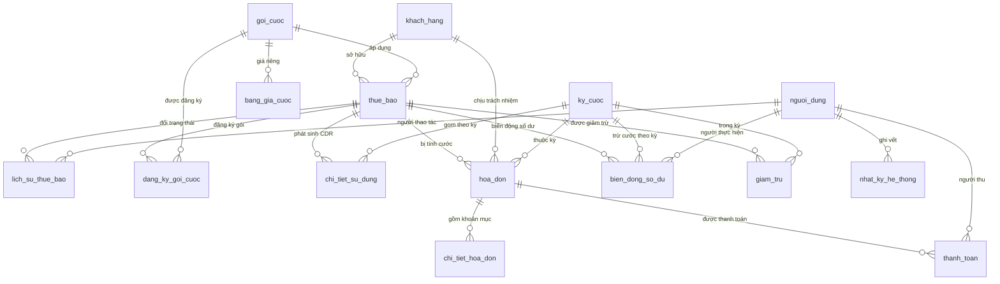

# MÔ TẢ CƠ SỞ DỮ LIỆU `vnpt_billing`

**Đề tài:** Xây dựng phần mềm quản lý thuê bao và tính cước điện thoại
**Môn học:** Thực tập nghề nghiệp — Phase 1
**Hệ quản trị:** MySQL 8.4 · InnoDB · `utf8mb4` / `utf8mb4_unicode_ci`

> Toàn bộ dữ liệu trong hệ thống là **dữ liệu mẫu tự sinh** phục vụ học tập.
> Không sử dụng dữ liệu thật của bất kỳ nhà mạng nào.

---

## 1. Tổng quan

CSDL gồm **15 bảng** và **2 view**, chia thành 4 nhóm chức năng:

| Nhóm | Bảng |
|---|---|
| Quản trị & danh mục | `nguoi_dung`, `khach_hang`, `goi_cuoc`, `bang_gia_cuoc` |
| Thuê bao | `thue_bao`, `lich_su_thue_bao`, `dang_ky_goi_cuoc` |
| Tính cước | `ky_cuoc`, `chi_tiet_su_dung`, `giam_tru` |
| Hóa đơn & thu tiền | `hoa_don`, `chi_tiet_hoa_don`, `thanh_toan`, `bien_dong_so_du` |
| Hệ thống | `nhat_ky_he_thong` |

### Sơ đồ quan hệ



### Quy ước chung

- Mọi bảng có khóa chính `id BIGINT AUTO_INCREMENT`.
- Tên bảng và cột dùng **tiếng Việt không dấu, `snake_case`**; phía Java dùng `camelCase`.
- Mọi trường tiền tệ dùng `DECIMAL`, **không dùng** `FLOAT`/`DOUBLE` để tránh sai số làm tròn.
- `DECIMAL(15,2)` cho số tiền thông thường, `DECIMAL(18,2)` cho số cộng dồn lớn (doanh thu kỳ).
- Cột cờ nhị phân dùng `TINYINT` (0/1), phía Java map sang `Boolean` kèm `@JdbcTypeCode(SqlTypes.TINYINT)`.
- Kiểu `ENUM` của MySQL map sang `enum` Java qua `@Enumerated(EnumType.STRING)`; **tên hằng phải khớp tuyệt đối**.

---

## 2. Chi tiết từng bảng

### 2.1. `nguoi_dung` — Tài khoản đăng nhập hệ thống

| Tên trường | Kiểu dữ liệu | Ràng buộc | Ý nghĩa |
|---|---|---|---|
| `id` | BIGINT | PK, AUTO_INCREMENT | Khóa chính |
| `ten_dang_nhap` | VARCHAR(50) | NOT NULL, UNIQUE | Tên đăng nhập |
| `mat_khau` | VARCHAR(100) | NOT NULL | Mật khẩu đã băm BCrypt, không lưu dạng thô |
| `ho_ten` | VARCHAR(100) | NOT NULL | Họ tên đầy đủ |
| `email` | VARCHAR(100) | | Thư điện tử liên hệ |
| `vai_tro` | ENUM | NOT NULL | `ADMIN` / `NHAN_VIEN` / `KE_TOAN` |
| `trang_thai` | TINYINT | DEFAULT 1 | 1 = đang hoạt động, 0 = đã khóa |
| `ngay_tao` | DATETIME | | Thời điểm tạo tài khoản |

### 2.2. `khach_hang` — Khách hàng cá nhân và doanh nghiệp

| Tên trường | Kiểu dữ liệu | Ràng buộc | Ý nghĩa |
|---|---|---|---|
| `id` | BIGINT | PK, AUTO_INCREMENT | Khóa chính |
| `ma_kh` | VARCHAR(20) | NOT NULL, UNIQUE | Mã khách hàng, dạng `KH000001` — **6 chữ số**, chuẩn hoá ở Phase 3A |
| `loai_kh` | ENUM | NOT NULL | `CA_NHAN` / `DOANH_NGHIEP` |
| `ten_kh` | VARCHAR(200) | NOT NULL, INDEX | Họ tên cá nhân hoặc tên doanh nghiệp |
| `so_giay_to` | VARCHAR(30) | NOT NULL, INDEX | CCCD (12 số) với cá nhân, MST (10 số) với doanh nghiệp |
| `ngay_sinh` | DATE | | Ngày sinh, chỉ dùng cho khách cá nhân |
| `nguoi_dai_dien` | VARCHAR(100) | | Người đại diện pháp luật, chỉ dùng cho doanh nghiệp |
| `dia_chi` | VARCHAR(300) | NOT NULL | Địa chỉ liên hệ |
| `dien_thoai_lh` | VARCHAR(15) | | Số điện thoại liên hệ |
| `email` | VARCHAR(100) | | Thư điện tử |
| `ngay_dang_ky` | DATE | NOT NULL | Ngày trở thành khách hàng |
| `trang_thai` | ENUM | NOT NULL | `HOAT_DONG` / `NGUNG_GIAO_DICH` |
| `ghi_chu` | TEXT | | Ghi chú tự do |

### 2.3. `goi_cuoc` — Danh mục gói cước

| Tên trường | Kiểu dữ liệu | Ràng buộc | Ý nghĩa |
|---|---|---|---|
| `id` | BIGINT | PK, AUTO_INCREMENT | Khóa chính |
| `ma_goi` | VARCHAR(20) | NOT NULL, UNIQUE | Mã gói, ví dụ `MAX150` |
| `ten_goi` | VARCHAR(100) | NOT NULL | Tên hiển thị của gói |
| `loai_thue_bao` | ENUM | NOT NULL | `TRA_TRUOC` / `TRA_SAU` — gói chỉ áp dụng cho đúng loại này |
| `cuoc_thue_bao_thang` | DECIMAL(15,2) | NOT NULL, DEFAULT 0 | Cước cố định thu hằng tháng |
| `phut_noi_mang_mien_phi` | INT | DEFAULT 0 | Số phút gọi nội mạng được miễn phí |
| `phut_ngoai_mang_mien_phi` | INT | DEFAULT 0 | Số phút gọi ngoại mạng được miễn phí |
| `sms_mien_phi` | INT | DEFAULT 0 | Số tin nhắn được miễn phí |
| `data_mien_phi_mb` | INT | DEFAULT 0 | Dung lượng data miễn phí, đơn vị MB |
| `mo_ta` | TEXT | | Diễn giải ưu đãi của gói |
| `ngay_hieu_luc` | DATE | NOT NULL | Ngày gói bắt đầu áp dụng |
| `ngay_het_hieu_luc` | DATE | | Ngày gói ngừng áp dụng, NULL = còn hiệu lực |
| `trang_thai` | TINYINT | DEFAULT 1 | 1 = còn mở bán, 0 = ngừng bán |

### 2.4. `bang_gia_cuoc` — Đơn giá theo dịch vụ / hướng / khung giờ

| Tên trường | Kiểu dữ liệu | Ràng buộc | Ý nghĩa |
|---|---|---|---|
| `id` | BIGINT | PK, AUTO_INCREMENT | Khóa chính |
| `goi_cuoc_id` | BIGINT | FK → `goi_cuoc(id)`, NULL được | **NULL = đơn giá mặc định** áp dụng chung cho mọi gói |
| `loai_dich_vu` | ENUM | NOT NULL, INDEX | `THOAI` / `SMS` / `DATA` |
| `huong` | ENUM | NOT NULL, INDEX | `NOI_MANG` / `NGOAI_MANG` / `QUOC_TE` |
| `gio_cao_diem` | TINYINT | DEFAULT 0 | 1 = đơn giá giờ cao điểm |
| `block_giay` | INT | NOT NULL, DEFAULT 6 | Đơn vị tính block: giây (thoại), 1 tin (SMS), 1 MB (data) |
| `don_gia` | DECIMAL(15,2) | NOT NULL | Đơn giá cho mỗi block |
| `ngay_hieu_luc` | DATE | NOT NULL, INDEX | Ngày bảng giá bắt đầu áp dụng |
| `ngay_het_hieu_luc` | DATE | | NULL = còn hiệu lực |

> **Chỉ mục** `idx_bang_gia_tra_cuu (loai_dich_vu, huong, ngay_hieu_luc)` phục vụ engine
> tính cước tra giá cho từng bản ghi CDR — đây là truy vấn nóng nhất của hệ thống.

### 2.5. `thue_bao` — Thuê bao điện thoại

| Tên trường | Kiểu dữ liệu | Ràng buộc | Ý nghĩa |
|---|---|---|---|
| `id` | BIGINT | PK, AUTO_INCREMENT | Khóa chính |
| `so_thue_bao` | VARCHAR(15) | NOT NULL, UNIQUE | Số điện thoại |
| `khach_hang_id` | BIGINT | NOT NULL, FK → `khach_hang(id)`, INDEX | Chủ sở hữu thuê bao |
| `goi_cuoc_id` | BIGINT | NOT NULL, FK → `goi_cuoc(id)` | Gói cước đang áp dụng |
| `loai_thue_bao` | ENUM | NOT NULL | `TRA_TRUOC` / `TRA_SAU` |
| `ngay_kich_hoat` | DATE | NOT NULL | Ngày hòa mạng |
| `ngay_huy` | DATE | | Ngày thanh lý, NULL nếu chưa thanh lý |
| `trang_thai` | ENUM | NOT NULL | `HOAT_DONG` / `TAM_NGUNG_1C` / `TAM_NGUNG_2C` / `DA_THANH_LY` |
| `so_du` | DECIMAL(15,2) | DEFAULT 0 | Số dư tài khoản, **chỉ có ý nghĩa với trả trước** |
| `han_muc_tin_dung` | DECIMAL(15,2) | DEFAULT 0 | Hạn mức nợ cước, **chỉ có ý nghĩa với trả sau**. Nợ vượt mức này thì thuê bao vào danh sách đề xuất tạm ngừng ở `/cong-no` — xem ghi chú dưới |
| `ngay_tao` | DATETIME | | Thời điểm tạo bản ghi |

> `TAM_NGUNG_1C` = tạm ngưng một chiều (chỉ nhận, không gọi đi).
> `TAM_NGUNG_2C` = tạm ngưng hai chiều (khóa cả hai chiều).

> ### ⚠️ `han_muc_tin_dung` từng là một cột chết
>
> Cột này có từ Phase 1: có trong bảng, có trên form đăng ký, có hiển thị ở màn hình chi tiết
> thuê bao — nhưng suốt **tám phase không một dòng mã nào đọc nó để chặn việc gì**. Người dùng
> nhập số vào đó và tin rằng hệ thống đang canh giúp mình, trong khi không.
>
> Nay `HoaDonRepository.timThueBaoVuotHanMuc()` dùng nó thật: cộng **toàn bộ** nợ chưa trả của
> một thuê bao rồi so với hạn mức, ai vượt thì hiện ở khối *Nợ vượt hạn mức tín dụng* trên
> màn hình `/cong-no`.
>
> **`0` nghĩa là CHƯA ĐẶT, không phải "không cho nợ đồng nào".** Truy vấn loại hẳn thuê bao có
> hạn mức 0 ra. Hiểu nhầm chỗ này sẽ lôi nguyên cả danh sách thuê bao vào diện đề xuất cắt
> dịch vụ — trong đó có cả 20 thuê bao trả trước, vốn có hạn mức 0 vì trả trước không có khái
> niệm cho nợ.
>
> Đây là **căn cứ tạm ngừng thứ hai, độc lập** với căn cứ "hóa đơn quá hạn quá 15 ngày": một
> khách có bốn hóa đơn mới quá hạn vài ngày nhưng cộng lại đã vượt hạn mức sẽ *không* lọt vào
> danh sách kia — mà đúng là trường hợp đáng chặn nhất.

### 2.6. `lich_su_thue_bao` — Nhật ký đổi trạng thái thuê bao

| Tên trường | Kiểu dữ liệu | Ràng buộc | Ý nghĩa |
|---|---|---|---|
| `id` | BIGINT | PK, AUTO_INCREMENT | Khóa chính |
| `thue_bao_id` | BIGINT | NOT NULL, FK → `thue_bao(id)`, INDEX | Thuê bao bị đổi trạng thái |
| `trang_thai_cu` | VARCHAR(20) | | Trạng thái trước khi đổi |
| `trang_thai_moi` | VARCHAR(20) | NOT NULL | Trạng thái sau khi đổi |
| `ly_do` | VARCHAR(300) | | Lý do thực hiện |
| `nguoi_thuc_hien_id` | BIGINT | FK → `nguoi_dung(id)` | Người thao tác |
| `thoi_gian` | DATETIME | NOT NULL | Thời điểm thực hiện |

### 2.7. `dang_ky_goi_cuoc` — Lịch sử đăng ký gói cước

| Tên trường | Kiểu dữ liệu | Ràng buộc | Ý nghĩa |
|---|---|---|---|
| `id` | BIGINT | PK, AUTO_INCREMENT | Khóa chính |
| `thue_bao_id` | BIGINT | NOT NULL, FK → `thue_bao(id)`, INDEX | Thuê bao đăng ký |
| `goi_cuoc_id` | BIGINT | NOT NULL, FK → `goi_cuoc(id)` | Gói được đăng ký |
| `ngay_bat_dau` | DATE | NOT NULL | Ngày bắt đầu áp dụng gói |
| `ngay_ket_thuc` | DATE | | Ngày kết thúc, NULL nếu đang áp dụng |
| `trang_thai` | ENUM | NOT NULL | `DANG_AP_DUNG` / `DA_KET_THUC` |

> Bảng này tách riêng khỏi `thue_bao.goi_cuoc_id` để giữ được **lịch sử đổi gói**.
> `thue_bao.goi_cuoc_id` chỉ phản ánh gói hiện hành, còn bảng này lưu toàn bộ quá trình.

### 2.8. `ky_cuoc` — Kỳ tính cước theo tháng

| Tên trường | Kiểu dữ liệu | Ràng buộc | Ý nghĩa |
|---|---|---|---|
| `id` | BIGINT | PK, AUTO_INCREMENT | Khóa chính |
| `thang` | INT | NOT NULL, UNIQUE(thang, nam) | Tháng của kỳ (1–12) |
| `nam` | INT | NOT NULL, UNIQUE(thang, nam) | Năm của kỳ |
| `ngay_bat_dau` | DATE | NOT NULL | Ngày đầu kỳ |
| `ngay_ket_thuc` | DATE | NOT NULL | Ngày cuối kỳ |
| `trang_thai` | ENUM | NOT NULL | `MO` / `DANG_TINH` / `DA_CHOT` |
| `ngay_chot` | DATETIME | | Thời điểm chốt kỳ |
| `so_cdr_xu_ly` | INT | DEFAULT 0 | Số bản ghi CDR đã xử lý trong kỳ |
| `so_hoa_don_tao` | INT | DEFAULT 0 | Số hóa đơn đã phát hành trong kỳ |
| `tong_doanh_thu` | DECIMAL(18,2) | DEFAULT 0 | Tổng doanh thu của kỳ |

> **Ràng buộc `UNIQUE(thang, nam)`** đảm bảo mỗi tháng chỉ tồn tại đúng một kỳ cước.

### 2.9. `chi_tiet_su_dung` — Bản ghi CDR (Call Detail Record)

| Tên trường | Kiểu dữ liệu | Ràng buộc | Ý nghĩa |
|---|---|---|---|
| `id` | BIGINT | PK, AUTO_INCREMENT | Khóa chính |
| `thue_bao_id` | BIGINT | NOT NULL, FK → `thue_bao(id)`, INDEX | Thuê bao phát sinh |
| `so_thue_bao` | VARCHAR(15) | NOT NULL | Số thuê bao **lưu lặp lại** tại thời điểm phát sinh |
| `so_bi_goi` | VARCHAR(20) | | Số bị gọi hoặc số nhận tin |
| `loai_dich_vu` | ENUM | NOT NULL | `THOAI` / `SMS` / `DATA` |
| `huong` | ENUM | NOT NULL | `NOI_MANG` / `NGOAI_MANG` / `QUOC_TE` |
| `thoi_gian_bat_dau` | DATETIME | NOT NULL, INDEX | Thời điểm bắt đầu sử dụng |
| `thoi_luong_giay` | INT | DEFAULT 0 | Thời lượng cuộc gọi (giây), chỉ dùng cho `THOAI` |
| `so_luong` | INT | DEFAULT 0 | Số tin với `SMS`, số **KB** với `DATA` |
| `gio_cao_diem` | TINYINT | DEFAULT 0 | 1 = phát sinh trong giờ cao điểm |
| `cuoc_phi` | DECIMAL(15,2) | | Cước tính được, NULL khi chưa tính |
| `mien_phi` | TINYINT | DEFAULT 0 | 1 = nằm trong ưu đãi của gói nên không thu tiền |
| `trang_thai_tinh_cuoc` | ENUM | NOT NULL, DEFAULT `CHUA_TINH`, INDEX | `CHUA_TINH` / `DA_TINH` / `LOI` |
| `ky_cuoc_id` | BIGINT | FK → `ky_cuoc(id)` | Kỳ cước mà bản ghi được gom vào |
| `bang_gia_cuoc_id` | BIGINT | FK → `bang_gia_cuoc(id)` | **Dòng bảng giá đã áp dụng khi định giá bản ghi này** |
| `nguon` | ENUM | | `GENERATOR` / `IMPORT_CSV` / `NHAP_TAY` |

> Cột `bang_gia_cuoc_id` **thêm ở Phase 4D**. Đây là ảnh chụp thật: bảng giá có thể đổi về
> sau, nhưng hóa đơn cũ vẫn truy nguyên được đúng đơn giá đã thu. Không có cột này thì khâu
> lập hóa đơn buộc phải suy ngược lại bảng giá — mà bảng giá lúc đó có thể đã khác, nên đơn
> giá in ra không phải đơn giá đã thu. Cột để `NULL` khi bản ghi chưa tính cước hoặc lỗi.

> Cột `so_thue_bao` **cố ý trùng lặp** với `thue_bao.so_thue_bao`. CDR là dữ liệu lịch sử:
> nếu thuê bao bị thanh lý và số được cấp lại cho khách khác, bản ghi cũ vẫn phải giữ
> đúng số tại thời điểm phát sinh.

> ⚠️ **Đơn vị của `so_luong` với dịch vụ DATA đã đổi ở Phase 3: từ MB sang KB.**
> Bộ sinh CDR sinh giá trị 1024–512000 KB (tức 1 MB đến 500 MB mỗi phiên), và màn hình
> tra cứu CDR quy đổi sang MB khi hiển thị.
>
> **Việc Phase 4 phải xử lý:** dòng bảng giá `DATA` hiện có `block_giay = 1` và đơn giá
> 25 đ, vốn được đặt theo giả định "1 block = 1 MB". Khi viết engine tính cước phải
> chọn một trong hai cách, không được bỏ qua:
> - Chia `so_luong` cho 1024 để đổi về MB trước khi nhân đơn giá, hoặc
> - Đổi `block_giay` của dòng DATA thành 1024 để block đúng bằng 1 MB tính theo KB
>
> Nếu bỏ qua, cước data sẽ bị tính cao gấp 1024 lần.

### 2.10. `hoa_don` — Hóa đơn cước tháng

| Tên trường | Kiểu dữ liệu | Ràng buộc | Ý nghĩa |
|---|---|---|---|
| `id` | BIGINT | PK, AUTO_INCREMENT | Khóa chính |
| `ma_hoa_don` | VARCHAR(30) | NOT NULL, UNIQUE | Số hóa đơn |
| `thue_bao_id` | BIGINT | NOT NULL, FK → `thue_bao(id)`, **UNIQUE(thue_bao_id, ky_cuoc_id)** | Thuê bao bị tính cước |
| `khach_hang_id` | BIGINT | NOT NULL, FK → `khach_hang(id)`, INDEX | Khách hàng chịu trách nhiệm thanh toán |
| `ky_cuoc_id` | BIGINT | NOT NULL, FK → `ky_cuoc(id)`, **UNIQUE(thue_bao_id, ky_cuoc_id)** | Kỳ cước |
| `ngay_lap` | DATE | NOT NULL | Ngày phát hành hóa đơn |
| `han_thanh_toan` | DATE | NOT NULL | Hạn thanh toán |
| `cuoc_thue_bao` | DECIMAL(15,2) | DEFAULT 0 | Cước thuê bao tháng |
| `cuoc_thoai` | DECIMAL(15,2) | DEFAULT 0 | Cước thoại phát sinh |
| `cuoc_sms` | DECIMAL(15,2) | DEFAULT 0 | Cước tin nhắn phát sinh |
| `cuoc_data` | DECIMAL(15,2) | DEFAULT 0 | Cước data phát sinh |
| `cuoc_khac` | DECIMAL(15,2) | DEFAULT 0 | Các khoản cước khác |
| `giam_tru` | DECIMAL(15,2) | DEFAULT 0 | Tổng khoản giảm trừ |
| `tong_truoc_thue` | DECIMAL(15,2) | NOT NULL | Cộng các khoản cước, trừ giảm trừ |
| `thue_vat` | DECIMAL(15,2) | NOT NULL | Thuế giá trị gia tăng |
| `tong_thanh_toan` | DECIMAL(15,2) | NOT NULL | Số tiền phải trả = trước thuế + VAT |
| `da_thanh_toan` | DECIMAL(15,2) | DEFAULT 0 | Số tiền đã thu |
| `con_no` | DECIMAL(15,2) | NOT NULL | Số tiền còn nợ |
| `trang_thai` | ENUM | NOT NULL | `CHUA_TT` / `TT_MOT_PHAN` / `DA_TT` / `QUA_HAN` |

> **Ràng buộc quan trọng nhất của CSDL:** `UNIQUE(thue_bao_id, ky_cuoc_id)`.
> Một thuê bao chỉ được lập đúng một hóa đơn cho mỗi kỳ. Nếu engine tính cước
> chạy lại do lỗi, CSDL sẽ từ chối bản ghi thứ hai thay vì âm thầm tạo hóa đơn trùng.

### 2.11. `chi_tiet_hoa_don` — Khoản mục trên hóa đơn

| Tên trường | Kiểu dữ liệu | Ràng buộc | Ý nghĩa |
|---|---|---|---|
| `id` | BIGINT | PK, AUTO_INCREMENT | Khóa chính |
| `hoa_don_id` | BIGINT | NOT NULL, FK → `hoa_don(id)` **ON DELETE CASCADE**, INDEX | Hóa đơn cha |
| `khoan_muc` | VARCHAR(150) | NOT NULL | Tên khoản mục |
| `so_luong` | DECIMAL(15,2) | | Số lượng (phút, tin, MB…) |
| `don_vi` | VARCHAR(20) | | Đơn vị tính |
| `don_gia` | DECIMAL(15,2) | | Đơn giá áp dụng |
| `thanh_tien` | DECIMAL(15,2) | NOT NULL | Thành tiền của dòng |

### 2.12. `thanh_toan` — Giao dịch thanh toán hóa đơn

| Tên trường | Kiểu dữ liệu | Ràng buộc | Ý nghĩa |
|---|---|---|---|
| `id` | BIGINT | PK, AUTO_INCREMENT | Khóa chính |
| `ma_giao_dich` | VARCHAR(30) | NOT NULL, UNIQUE | Mã giao dịch, chống ghi nhận trùng |
| `hoa_don_id` | BIGINT | NOT NULL, FK → `hoa_don(id)`, INDEX | Hóa đơn được thanh toán |
| `so_tien` | DECIMAL(15,2) | NOT NULL | Số tiền thu |
| `hinh_thuc` | ENUM | NOT NULL | `TIEN_MAT` / `CHUYEN_KHOAN` / `VI_DIEN_TU` |
| `ngay_thanh_toan` | DATETIME | NOT NULL | Thời điểm thu tiền |
| `nguoi_thu_id` | BIGINT | FK → `nguoi_dung(id)` | Nhân viên thu |
| `ghi_chu` | VARCHAR(300) | | Ghi chú |

> Một hóa đơn có thể có **nhiều** bản ghi thanh toán (thanh toán từng phần).

### 2.13. `bien_dong_so_du` — Sổ cái biến động số dư thuê bao trả trước

> **Đổi ở Phase 5 mục G1.** Bảng này trước tên là `nap_tien` và chỉ ghi chiều **nạp**.
> Trừ cước khi đó không để lại vết nào — trừ xong chỉ còn `thue_bao.so_du` đã đổi, nhìn vào
> không biết con số đó đến từ đâu. Cách xử lý là **tổng quát hoá chính bảng cũ**, cố ý
> **không** thêm bảng thứ hai cho phần trừ: hai bảng cùng ghi số dư là hai nguồn sự thật.

| Tên trường | Kiểu dữ liệu | Ràng buộc | Ý nghĩa |
|---|---|---|---|
| `id` | BIGINT | PK, AUTO_INCREMENT | Khóa chính |
| `thue_bao_id` | BIGINT | NOT NULL, FK → `thue_bao(id)`, INDEX | Thuê bao |
| `loai_bien_dong` | ENUM | NOT NULL | `NAP_TIEN` / `TRU_CUOC` / `DIEU_CHINH` |
| `so_tien` | DECIMAL(15,2) | NOT NULL | **Luôn dương**; chiều cộng/trừ do `loai_bien_dong` quyết định |
| `so_du_truoc` | DECIMAL(15,2) | | Số dư trước giao dịch |
| `so_du_sau` | DECIMAL(15,2) | | Số dư sau giao dịch |
| `hinh_thuc` | ENUM | | `THE_CAO` / `CHUYEN_KHOAN` / `TAI_QUAY` — chỉ có nghĩa với `NAP_TIEN` |
| `ky_cuoc_id` | BIGINT | FK → `ky_cuoc(id)`, INDEX | Chỉ có giá trị với `TRU_CUOC` |
| `so_cdr_da_tru` | INT | | Số bản ghi CDR thực sự được trừ — chỉ với `TRU_CUOC` |
| `so_tien_khong_thu_duoc` | DECIMAL(15,2) | | Phần cước không thu được vì hết số dư — chỉ với `TRU_CUOC` |
| `ngay_ghi_nhan` | DATETIME | NOT NULL | Thời điểm ghi sổ |
| `nguoi_thuc_hien_id` | BIGINT | FK → `nguoi_dung(id)` | Người thực hiện (null nếu do hệ thống) |

> Hai cột `so_du_truoc` / `so_du_sau` lưu ảnh chụp số dư để **đối soát** về sau,
> không phải dữ liệu suy ra được sau khi số dư đã thay đổi nhiều lần. Chính hai cột này
> làm bảng thành **sổ cái** chứ không phải một danh sách giao dịch.

> ### ⚠️ `so_tien_khong_thu_duoc` KHÔNG phải một khoản nợ
>
> **Thuê bao trả trước không có nợ.** Với trả trước thời gian thực, cuộc gọi làm cạn số dư bị
> chặn ngay tại thời điểm phát sinh, nên số tiền này *không bao giờ tồn tại*.
>
> Nó chỉ xuất hiện vì hệ thống mô phỏng **định giá trước, trừ sau, theo lô cuối kỳ** — cộng với
> quy tắc không cắt đôi bản ghi. Đây là **hiện vật của mô hình**, không phải nghiệp vụ.
>
> Vì vậy cột này ghi lại chênh lệch để đối soát được, và **cố ý không có bảng nợ** cho thuê bao
> trả trước. Thêm bảng nợ sẽ là mô hình hoá một thứ không tồn tại — đúng loại lỗi mà mục 4A đã
> gặp với `DATA/NGOAI_MANG`.

**Quy tắc dấu** gom trong enum `LoaiBienDongSoDu`, không rải ra chỗ khác: `NAP_TIEN` và
`DIEU_CHINH` cộng vào số dư, `TRU_CUOC` trừ đi. Nếu về sau cần điều chỉnh *giảm* thì phải
thêm giá trị enum riêng — đổi dấu `DIEU_CHINH` sẽ làm một loại mang hai ý nghĩa.

**Bất biến kiểm ở khâu build** (`KiemTraSoCaiSoDuTest`, 2 test):

```
so_du = SUM(nạp + điều chỉnh) − SUM(trừ)      -- đúng với MỌI thuê bao
so_du_sau − so_du_truoc = số tiền đã áp dấu   -- đúng với TỪNG dòng
```

Test thứ hai kiểm **từng dòng** vì test thứ nhất kiểm ở mức tổng, mà hai dòng sai ngược dấu
sẽ triệt tiêu nhau ở mức tổng (bài học 43.3).

### 2.14. `giam_tru` — Khoản giảm trừ trên hóa đơn

| Tên trường | Kiểu dữ liệu | Ràng buộc | Ý nghĩa |
|---|---|---|---|
| `id` | BIGINT | PK, AUTO_INCREMENT | Khóa chính |
| `thue_bao_id` | BIGINT | NOT NULL, FK → `thue_bao(id)`, INDEX | Thuê bao được giảm trừ |
| `ky_cuoc_id` | BIGINT | FK → `ky_cuoc(id)` | Kỳ áp dụng, NULL = áp dụng chung |
| `loai` | ENUM | NOT NULL | `KHUYEN_MAI` / `SU_CO_DICH_VU` / `CHIET_KHAU_DN` / `KHAC` |
| `so_tien` | DECIMAL(15,2) | | Giảm trừ theo số tiền tuyệt đối |
| `ty_le_phan_tram` | DECIMAL(5,2) | | Giảm trừ theo tỷ lệ phần trăm |
| `ly_do` | VARCHAR(300) | | Diễn giải lý do |
| `trang_thai` | ENUM | | `CHUA_AP_DUNG` / `DA_AP_DUNG` |

### 2.15. `nhat_ky_he_thong` — Ghi vết thao tác người dùng

| Tên trường | Kiểu dữ liệu | Ràng buộc | Ý nghĩa |
|---|---|---|---|
| `id` | BIGINT | PK, AUTO_INCREMENT | Khóa chính |
| `nguoi_dung_id` | BIGINT | FK → `nguoi_dung(id)`, INDEX | Người thực hiện |
| `hanh_dong` | VARCHAR(100) | NOT NULL | Tên hành động, ví dụ `TAO_HOA_DON` |
| `doi_tuong` | VARCHAR(50) | | Loại đối tượng bị tác động, ví dụ `THUE_BAO` |
| `doi_tuong_id` | BIGINT | | Khóa chính của đối tượng |
| `noi_dung` | TEXT | | Diễn giải chi tiết |
| `dia_chi_ip` | VARCHAR(45) | | Địa chỉ IP, đủ dài cho IPv6 |
| `thoi_gian` | DATETIME | NOT NULL | Thời điểm thao tác |

---

## 3. Các view

### 3.1. `v_thong_ke_thue_bao`

Đếm số thuê bao theo loại và trạng thái, kèm tổng số dư.

| Cột | Ý nghĩa |
|---|---|
| `loai_thue_bao` | `TRA_TRUOC` / `TRA_SAU` |
| `trang_thai` | Trạng thái thuê bao |
| `so_luong` | Số thuê bao thuộc nhóm |
| `tong_so_du` | Tổng số dư của nhóm |

### 3.2. `v_doanh_thu_thang`

Tổng hợp doanh thu hóa đơn theo năm/tháng của kỳ cước. Dùng `LEFT JOIN` nên kỳ
chưa có hóa đơn nào vẫn xuất hiện với giá trị 0.

| Cột | Ý nghĩa |
|---|---|
| `nam`, `thang` | Kỳ cước |
| `so_hoa_don` | Số hóa đơn đã phát hành |
| `tong_doanh_thu` | Tổng `tong_thanh_toan` |
| `da_thu` | Tổng `da_thanh_toan` |
| `con_no` | Tổng `con_no` |

---

## 4. Dữ liệu mẫu hiện có

| Bảng | Số bản ghi | Ghi chú |
|---|---|---|
| `nguoi_dung` | 3 | `admin`, `nhanvien01`, `ketoan01` — mật khẩu đều là `123456` (băm BCrypt) |
| `khach_hang` | 50 | 35 cá nhân + 15 doanh nghiệp, địa chỉ các tỉnh ĐBSCL |
| `goi_cuoc` | 5 | CB01, MAX70, MAX150, DN500, TT01 |
| `bang_gia_cuoc` | 10 | 7 dòng giá thường + 3 dòng giờ cao điểm (thoại, +20%) |
| `thue_bao` | 80 | 60 trả sau + 20 trả trước |
| `dang_ky_goi_cuoc` | 80 | Mỗi thuê bao một bản ghi `DANG_AP_DUNG` |
| `ky_cuoc` | 6 | Tháng 3–8/2026 — đều khởi tạo ở trạng thái `MO`; kỳ 8 **cố ý để rỗng** |
| `bien_dong_so_du` | 18 | Dòng **mở sổ** cho 18 thuê bao trả trước có số dư > 0 — xem ghi chú dưới |
| `nhat_ky_he_thong` | 0 | Vết thao tác người dùng — cố ý không đưa vào dữ liệu mẫu |

> **Vì sao có 18 dòng mở sổ.** Số dư mẫu được nạp thẳng vào `thue_bao.so_du`, không có dòng
> sổ cái nào chống lưng, nên bất biến `so_du = SUM(nạp) − SUM(trừ)` sẽ **sai ngay từ đầu**
> trên cả 18 thuê bao (285.000 ≠ 0 − 0). Mỗi dòng là một bút toán `DIEU_CHINH` đưa số dư từ
> 0 lên đúng giá trị mẫu, `ngay_ghi_nhan` lấy theo `ngay_kich_hoat` của chính thuê bao đó.
> Hai thuê bao còn lại (id 8, 15) có số dư 0 nên không cần dòng mở sổ: `0 = 0 − 0`.

> Bảng trên là nội dung **của script `data-mau.sql`** — phần dữ liệu **gốc, viết tay**.

### 4.1. Phần vận hành — `data-van-hanh.sql` (thêm ở Phase 5 mục F)

Từ Phase 5 mục F, kết quả vận hành cũng được lưu thành script và chạy **ngay sau**
`data-mau.sql`. Số liệu dưới đây là bản dump hiện hành, cập nhật ở Phase 7 sau khi Phase 6
bổ sung kỳ 3, 4 và 7:

| Bảng | Số bản ghi | Ghi chú |
|---|---|---|
| `chi_tiet_su_dung` | 18.723 | 2.770 + 3.239 + 3.697 + 5.017 + 4.000 cho kỳ 3→7, tất cả `DA_TINH`; kỳ 8 không có bản ghi nào |
| `hoa_don` | 280 | 55 · 55 · 54 · 58 · 58 theo thứ tự kỳ 3→7 |
| `chi_tiet_hoa_don` | 620 | 618 dòng cước + 2 dòng "Giảm trừ" thành tiền âm |
| `thanh_toan` | 161 | Kỳ 3: 58 · kỳ 4: 55 · kỳ 5: 48 · **kỳ 6, 7, 8: 0** |
| `bien_dong_so_du` | +16 | Dòng `TRU_CUOC` kỳ 6, cộng với 18 dòng mở sổ ở trên là 34 |
| `giam_tru` | 2 | Cả hai `DA_AP_DUNG` cho kỳ 6 |

> **Ba kỳ cố ý giữ 0 thanh toán.** Kỳ 6 và 7 giữ 0 để `huyBillingKy` còn xoá được hóa đơn —
> đó là hai kỳ duy nhất còn demo được trọn vòng *huỷ hóa đơn → lập lại*. Kỳ 8 giữ 0 vì nó
> chưa có hóa đơn nào. Chi tiết: `PHASE-7-REPORT.md` mục 6.

Ranh giới giữa hai file là ranh giới về **nguồn gốc**, không phải về chủ đề: `data-mau.sql` do
người viết ra và sửa tay được; `data-van-hanh.sql` là **bản dump** các dòng thực tế sau khi
chạy trọn các bước nghiệp vụ qua đúng đường code — sửa tay nó là dựng ra nguồn sự thật thứ hai
cạnh đoạn mã sinh ra nó.

> **Vì sao phải có file thứ hai.** Trước mục F, toàn bộ phần vận hành chỉ tồn tại trong CSDL
> đang chạy. Mà `CdrGeneratorService` dùng `new Random()` **không hạt giống**, nên chạy `reset`
> rồi sinh lại CDR sẽ ra một bộ số khác hẳn — tức `reset` không phải "nạp lại dữ liệu mẫu" mà
> là **xoá sổ** bộ dữ liệu mà `PHASE-4-REPORT.md` và `PHASE-5-REPORT.md` dựa vào. Chi tiết:
> `PHASE-5-REPORT.md` mục 23.1.

Trạng thái bàn giao đầy đủ cho Phase 6 xem `PHASE-5-REPORT.md` mục 31.

**Số dư thuê bao trả trước** (điều chỉnh ở Phase 4F): 15 thuê bao có 200.000–500.000 đ,
3 thuê bao cố ý để thấp khoảng 20.000 đ để Phase 5 có trường hợp *"số dư không đủ"*, và
2 thuê bao để 0 đ vì đã tạm ngưng hai chiều hoặc đã thanh lý.

**Phân bố thuê bao:**

| Trạng thái | Số lượng |
|---|---|
| `HOAT_DONG` | 65 |
| `TAM_NGUNG_1C` | 8 |
| `TAM_NGUNG_2C` | 4 |
| `DA_THANH_LY` | 3 |

Mỗi khách doanh nghiệp sở hữu 2–5 thuê bao (tổng 45), mỗi khách cá nhân 1 thuê bao
(tổng 35). Năm thuê bao kích hoạt giữa tháng 6/2026 (`id` 34, 35, 78, 79, 80) dùng để
thử nghiệm tính cước theo tỷ lệ ngày (prorate) ở Phase 4.

---

## 5. Lưu ý vận hành

### 5.1. Script khởi tạo chỉ chạy khi được yêu cầu

`application.yml` đặt `spring.sql.init.mode: never` **từ Phase 2**, nên `schema.sql`,
`data-mau.sql` và `data-van-hanh.sql` **không** chạy lại ở mỗi lần khởi động và dữ liệu nhập
qua giao diện được giữ nguyên.

Muốn nạp lại bộ dữ liệu mẫu từ đầu thì chạy với profile `reset`:

```bash
mvnw spring-boot:run "-Dspring-boot.run.profiles=reset"
```

> ⚠️ Profile `reset` bật `mode: always`, mà `schema.sql` mở đầu bằng `DROP TABLE IF EXISTS`
> theo thứ tự ngược phụ thuộc khóa ngoại — **toàn bộ dữ liệu đang có sẽ mất**. Chỉ dùng khi
> chủ đích làm mới CSDL.
>
> Profile này cũng tắt DevTools (`spring.devtools.restart.enabled: false`). Lý do ghi ở
> `PHASE-4-REPORT.md` mục 15: DevTools thấy `target/` đổi sẽ tự khởi động lại, và ở profile
> `reset` thì mỗi lần khởi động lại là một lần `DROP TABLE`.

### 5.2. Ánh xạ kiểu dữ liệu cần lưu ý

| Kiểu MySQL | Kiểu Java | Cách khai báo |
|---|---|---|
| `DECIMAL(15,2)` | `BigDecimal` | `@Column(precision = 15, scale = 2)` |
| `DATE` | `LocalDate` | mặc định |
| `DATETIME` | `LocalDateTime` | mặc định |
| `ENUM` | `enum` Java | `@Enumerated(EnumType.STRING)` |
| `TINYINT` (cờ 0/1) | `Boolean` | `@JdbcTypeCode(SqlTypes.TINYINT)` |
| `TEXT` | `String` | `@Column(columnDefinition = "TEXT")` |

Riêng dòng `TINYINT` là điểm dễ sai: nếu chỉ khai `Boolean` không kèm `@JdbcTypeCode`,
Hibernate mặc định mong đợi cột kiểu `BIT` và sẽ báo lỗi khi chạy với
`spring.jpa.hibernate.ddl-auto=validate`.

---

## 6. ⚠️ BA CHỖ QUY ĐỔI ĐƠN VỊ

> **Cập nhật sau Phase 4.** Mục này ban đầu chỉ ghi **hai** chỗ quy đổi KB/MB. Rà soát đầu
> Phase 4 phát hiện **chỗ thứ ba** cùng loại và cùng mức nguy hiểm: quỹ ưu đãi thoại khai
> bằng **phút** còn CDR lưu bằng **giây**. Cả ba nay đã được cài đặt và gom vào một lớp
> duy nhất — `service/rating/DonViCuoc.java`.

Sản lượng trong hệ thống lưu ở **đơn vị nhỏ** (giây, KB), còn ưu đãi của gói khai ở **đơn vị
lớn** (phút, MB). Quên quy đổi ở bất kỳ chỗ nào cũng cho ra hóa đơn sai mà không có cảnh báo.

| # | Cột | Đơn vị lưu | Đối chiếu với | Sai số nếu quên |
|---|---|---|---|---|
| 1 | `chi_tiet_su_dung.so_luong` (DATA) | **KB** | đơn giá đặt theo MB | **×1024** |
| 2 | `goi_cuoc.data_mien_phi_mb` | **MB** | sản lượng lưu bằng KB | **×1024** |
| 3 | `goi_cuoc.phut_*_mien_phi` | **PHÚT** | `thoi_luong_giay` lưu bằng GIÂY | **×60** |

### 6.0. Cách đã cài đặt: so ở đơn vị NHỎ NHẤT

Có hai cách khớp hai đơn vị, và chúng **không** cho cùng kết quả:

| Cách | Làm gì | Hệ quả |
|---|---|---|
| A | Quy từng bản ghi **lên** đơn vị của quỹ, làm tròn lên | Thổi phồng sản lượng — đo trên dữ liệu mẫu: **+10,97%** với thoại |
| B ✅ | Quy quỹ **xuống** đơn vị của bản ghi, phép nhân đúng | Không có phép làm tròn nào |

Hệ thống dùng **cách B**: `quota_phút × 60` và `quota_MB × 1024`, rồi so với tổng giây và
tổng KB thô. Cách A làm 4 thuê bao trong dữ liệu mẫu bị coi là vượt quỹ trong khi chưa hề
vượt — chi tiết ở `PHASE-4-REPORT.md` mục 23.

### 6.1. Vì sao chỗ thứ hai nguy hiểm hơn

Chỗ thứ nhất (`so_luong`) nếu quên sẽ cho ra con số tiền lớn bất thường, nhìn hóa đơn
là thấy ngay.

Chỗ thứ hai âm thầm hơn nhiều. Giả sử thuê bao dùng gói MAX70 (ưu đãi 2048 MB) và
phát sinh tổng 1.500.000 KB trong tháng — tức khoảng 1465 MB, **vẫn nằm trong ưu đãi,
đáng lẽ không mất tiền data**.

Nếu engine so thẳng `1500000 > 2048` thì kết luận thuê bao đã vượt ưu đãi và tính cước
cho phần "vượt" khổng lồ. Hậu quả:

- Hóa đơn **vẫn phát hành bình thường**, không lỗi, không cảnh báo
- Mọi thuê bao đều bị coi là vượt ưu đãi data, sai lệch khoảng **1024 lần**
- Chỉ phát hiện được khi có người ngồi đối chiếu tay một hóa đơn cụ thể

### 6.2. Cách kiểm chứng nhanh ở Phase 4

Sau khi chạy tính cước, đối chiếu một thuê bao dùng ít data:

```sql
SELECT t.so_thue_bao,
       g.ma_goi,
       g.data_mien_phi_mb                              AS uu_dai_mb,
       ROUND(SUM(c.so_luong) / 1024, 2)                AS da_dung_mb,
       SUM(c.so_luong)                                 AS da_dung_kb
FROM chi_tiet_su_dung c
JOIN thue_bao t ON t.id = c.thue_bao_id
JOIN goi_cuoc g ON g.id = t.goi_cuoc_id
WHERE c.loai_dich_vu = 'DATA'
GROUP BY t.id
HAVING da_dung_mb < uu_dai_mb
LIMIT 5;
```

Những thuê bao lọt vào kết quả này **phải có cước data bằng 0**. Nếu khác 0 thì engine
đang mắc đúng lỗi mô tả ở trên.

### 6.3. Đã cài đặt — lớp `DonViCuoc`

Khuyến nghị ban đầu là gom phép quy đổi vào một chỗ. Phase 4A đã làm, và mở rộng cho cả ba
chỗ cùng hai chiều quy đổi:

```java
public final class DonViCuoc {
    public static final int KB_MOI_MB    = 1024;
    public static final int GIAY_MOI_PHUT = 60;

    // Chiều LÊN - lam tròn LÊN, dùng khi tính tiền
    public static long soBlock(long soLuong, int kichThuocBlock)  // ceil
    public static long kbSangMb(long soKb)        // = soBlock(soKb, 1024)
    public static long giaySangPhut(long soGiay)  // = soBlock(soGiay, 60)

    // Chiều XUỐNG - phép nhân đúng, dùng khi so với quỹ ưu đãi
    public static long phutSangGiay(long soPhut)  // × 60
    public static long mbSangKb(long soMb)        // × 1024
}
```

Chia nguyên `(a + b - 1) / b` thay vì `Math.ceil` trên số thực: số nguyên không có sai số
dấu phẩy động, nên không bao giờ gặp chuyện `3000/60` ra `49,999…` rồi làm tròn thành 50.

Lớp này có **13 unit test** riêng (`DonViCuocTest`), trong đó hai test dựng đúng hai ví dụ
cảnh báo ở mục 6.1 và 6.2 trên: 1.500.000 KB phải ra 1465 MB, và 5.400 giây phải ra 90 phút.

### 6.4. Truy nguyên đơn giá — cột `bang_gia_cuoc_id`

Phase 4D bổ sung cột `chi_tiet_su_dung.bang_gia_cuoc_id` để lưu **dòng bảng giá đã áp dụng**
tại thời điểm định giá. Nhờ nó, hóa đơn cũ truy nguyên được đúng đơn giá đã thu ngay cả sau
khi bảng giá thay đổi, và bước áp ưu đãi chạy lại được nhiều lần mà không sai số.

Bất biến kiểm ở khâu build (`KiemTraDoPhuBangGiaTest`): mọi bản ghi `DA_TINH` đều phải có
`bang_gia_cuoc_id` khác NULL.
